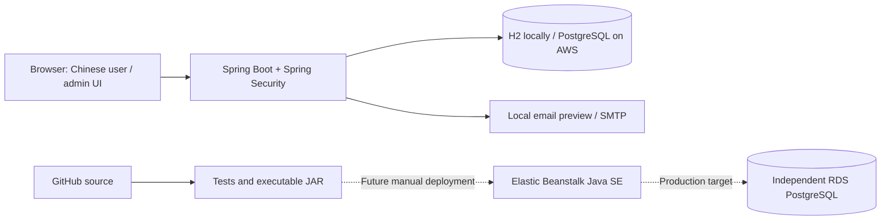
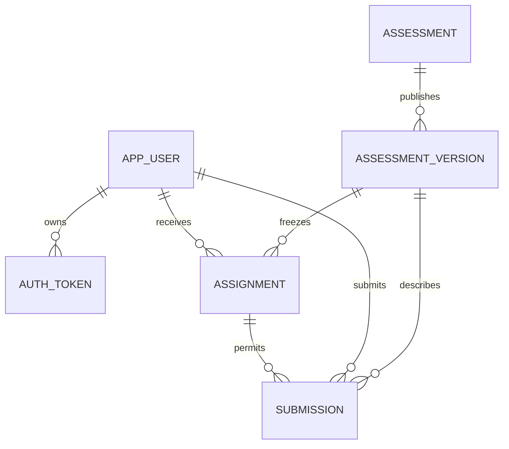

# Psychological Value Assessment Platform

A Spring Boot application for email-verified accounts, versioned questionnaires, administrator-assigned assessments, and private submission history. The web interface is in Simplified Chinese; the project documentation is in English.

The questionnaires support self-reflection. They are custom-authored examples, not clinically validated instruments or psychological, medical, or career diagnoses.

## Project status

- The new application lives in [`spring-app/`](spring-app/) on `feat/spring-boot-platform`.
- It runs locally without Cloudflare, Docker, or a separately installed database.
- PostgreSQL and AWS deployment configuration are provided. **This branch is not an AWS deployment.** No AWS resources, production database, or real email delivery are provisioned by cloning or running it.
- The original Cloudflare Pages/Functions application remains in `public/`, `functions/`, and `migrations/`. Its `main` branch and deployment are separate from this version.
- GitHub stores source code and documentation, not registered users, contact information, passwords, or submitted answers.

## Features

- Registration with username, email, WeChat contact, phone number, and password.
- One-time email verification, password reset, and administrator-controlled account status.
- Separate user and administrator experiences, enforced by server-side authorization.
- Multiple independently saved assessments, draft editing, copying, publishing, and archiving.
- An editor for question ordering, total/question score conditions, AND/OR groups, result priority, and one fallback result.
- Immutable published versions and assignments to specific verified users.
- Repeated submissions with immutable results and question-version history.
- User-owned submission history and administrator filters by user, assessment, and date.
- Optimistic draft conflict detection, server-side scoring, and idempotent submission retries.
- Local email previews and optional SMTP delivery, including Amazon SES SMTP.

## User roles

| Capability | User | Administrator |
| --- | --- | --- |
| View own account details | Yes | Yes |
| Complete assigned assessments | Yes | Yes, when assigned |
| View own answers and results | Yes | Yes |
| Edit questions and scoring rules | No | Yes |
| Publish or archive assessments | No | Yes |
| Assign/revoke assessments | No | Yes |
| View other users' submissions | No | Yes |
| Enable/disable accounts or change roles | No | Yes |
| Read anyone's password | No | No |

Registration always creates a regular user. Only the local initialization command can create the first administrator; subsequent administrators are appointed in the admin UI. The final enabled, verified administrator cannot be disabled or demoted.

## Tech stack

| Layer | Technology |
| --- | --- |
| Runtime | Java 21 |
| Application | Spring Boot 4.1.1, Spring MVC |
| Authorization | Spring Security, BCrypt, CSRF protection |
| Sessions | Spring Session JDBC, HttpOnly/SameSite cookies |
| Persistence | Spring Data JPA, Flyway |
| Local database | H2 file database |
| Production database target | PostgreSQL 17 / Amazon RDS |
| Frontend | HTML, CSS, JavaScript ES modules; no frontend framework |
| Build | Maven 3.9.11 via Maven Wrapper |
| Tests | JUnit, MockMvc, real JDBC-backed sessions; optional Playwright smoke test |
| CI | GitHub Actions, H2 and PostgreSQL 17 test jobs |

## Architecture



The application serves both frontend and API from the same origin. Browsers send answers, not trusted totals or grades. The server resolves the logged-in user and assigned version, validates every answer, calculates the result, and commits the submission atomically. User-facing APIs never return scoring conditions.

## Data model



`assessment` stores the mutable draft and revision counter. `assessment_version` stores an immutable configuration snapshot. `assignment` links a user to that version. `submission` stores the answers, result snapshot, total, and timestamp. Session tables are separate. Foreign keys preserve these relationships, and `(user_id, idempotency_key)` is unique.

Changing or archiving an assessment does not rewrite previous submissions. Revoking an assignment prevents new submissions but does not hide the owner's existing history.

## Prerequisites

- JDK 21 with `java` available on `PATH`.
- Git and an internet connection for the first Maven Wrapper/dependency download.
- A modern browser.
- Optional: Docker for local PostgreSQL; Node.js and Playwright for browser smoke testing.

Maven itself does not need to be preinstalled.

## Quick start

Clone the implementation branch:

```sh
git clone --branch feat/spring-boot-platform https://github.com/windyx3/psychological-value-test.git
cd psychological-value-test/spring-app
```

### Windows PowerShell

```powershell
.\mvnw.cmd -B -ntp verify
java -jar target/assessment-platform.jar --spring.main.web-application-type=none --app.command=bootstrap-admin
java -jar target/assessment-platform.jar
```

### macOS / Linux

```sh
./mvnw -B -ntp verify
java -jar target/assessment-platform.jar --spring.main.web-application-type=none --app.command=bootstrap-admin
java -jar target/assessment-platform.jar
```

Open:

- User application: <http://127.0.0.1:8080/>
- Admin dashboard: <http://127.0.0.1:8080/admin/>
- Login/registration: <http://127.0.0.1:8080/auth/>
- Development email preview: <http://127.0.0.1:8080/dev/mailbox>
- Health check: <http://127.0.0.1:8080/actuator/health>

The default `local` profile binds to localhost. User data is stored under `spring-app/data/`, relative to the working directory. Start and bootstrap from the same directory. Stop the app before running the initialization command against its H2 file.

There are **no default production credentials**. The bootstrap command requires a real interactive terminal; it prompts for contact details and reads the password without displaying it. The operator-created administrator is trusted as verified. It refuses to run if an active administrator already exists or the requested identity is already registered.

An example assessment is seeded on first local startup if the database contains no assessments. It is the repository's 15-question example, not a copy of any subsequently edited Cloudflare database. No users receive it automatically.

## Configuration

| Variable | Default / purpose |
| --- | --- |
| `SPRING_PROFILES_ACTIVE` | Unset uses `local`; `local,postgres` uses local PostgreSQL; `prod` enables production settings |
| `PORT` | `8080`; Elastic Beanstalk's Procfile explicitly uses `5000` |
| `APP_BASE_URL` | `http://127.0.0.1:8080`; production must use your HTTPS origin |
| `LOCAL_DB_PASSWORD` | Optional local H2 password |
| `DATABASE_URL` | JDBC PostgreSQL URL; required in production |
| `DATABASE_USERNAME` | Database login; required in production |
| `DATABASE_PASSWORD` | Database password; required in production |
| `MAIL_MODE` | `preview` locally; production forces `smtp` |
| `MAIL_FROM` | Verified sending address for SMTP |
| `SMTP_HOST`, `SMTP_PORT` | SMTP endpoint, default port `587` |
| `SMTP_USERNAME`, `SMTP_PASSWORD` | SMTP authentication credentials |
| `SEED_DEFAULT` | `true` locally; production defaults to no sample data |

See [`spring-app/.env.example`](spring-app/.env.example). Spring Boot does not automatically read a `.env` file: set application variables in your shell or hosting environment. Docker Compose reads `.env` for its database container only.

### Optional local PostgreSQL

Copy `.env.example` to `.env` and choose a local database password. Then:

```sh
docker compose up -d
```

PowerShell:

```powershell
$env:SPRING_PROFILES_ACTIVE = 'local,postgres'
$env:DATABASE_PASSWORD = 'the-password-you-put-in-dot-env'
java -jar target/assessment-platform.jar
```

macOS/Linux:

```sh
SPRING_PROFILES_ACTIVE=local,postgres DATABASE_PASSWORD='the-password-you-put-in-dot-env' java -jar target/assessment-platform.jar
```

This is a separate database; initialize an administrator there with the same environment and the bootstrap command. Flyway creates the schema. Switching database URLs does not transfer existing data. `docker compose down` stops the service without removing its named data volume.

## Email verification

1. Register an account with all required fields.
2. In local preview mode, open `/dev/mailbox` and refresh.
3. Open the email link and explicitly confirm verification.
4. Log in. An administrator can now assign an assessment.

Preview messages are kept in memory, contain synthetic/local development links, and disappear on restart. The preview routes require the local profile and a loopback request. `prod` cannot be combined with `local`.

Verification links expire after 24 hours. Reset links expire after 30 minutes. Tokens are stored as SHA-256 hashes, consumed once, and invalidated by a subsequent request for the same purpose. Links put the token in the URL fragment; the client removes it from the address bar and sends it only when the user confirms. Resetting a password invalidates existing sessions.

To send real email later, configure SMTP and set `MAIL_MODE=smtp` locally, or use the production profile. SMTP uses authentication, required STARTTLS, and bounded network timeouts. Sending failure leaves the account unverified; users can request another email. The resend/reset response intentionally does not reveal whether a particular email is registered.

Amazon SES is an optional SMTP provider. Sandbox accounts cannot send verification messages to arbitrary recipients; sender verification and production access are prerequisites for public registration. See the [SES production-access documentation](https://docs.aws.amazon.com/ses/latest/dg/request-production-access.html).

## Assessment publishing and assignments

1. Open **套题管理** and create an assessment, or copy an existing one.
2. Edit questions, descriptions, results, conditions, and the fallback result.
3. **保存草稿** saves changes without modifying any assigned version.
4. **保存并预览** saves the draft and opens an administrator-only preview. Preview scoring uses the server but does not create a submission.
5. **发布草稿** creates a new immutable version.
6. Select **分配用户**, choose a published version, and select verified, enabled users. Alternatively, assign from a user's detail page.

Within each result, condition groups are combined with OR; each group uses AND or OR. Non-fallback results are evaluated in displayed order, and the first match wins. The single fallback is considered last regardless of display position.

The sample rules remain: B if q13 < 5 AND q15 < 5; otherwise S if total > 100 and q4/q13/q14/q15 >= 7; otherwise A if total > 80 and q13/q14/q15 >= 7; otherwise C.

Assignments stay pinned to their original version. Publishing v2 does not silently upgrade users assigned v1. Reassigning an existing user/version reactivates the same assignment rather than duplicating it. Archiving blocks new assignments and submissions; restoring re-enables assignments not explicitly revoked.

## Submission history

Users enter whole-number scores from 1 through 10. All fields start empty. Invalid answers are highlighted with a single summary message; no incomplete submission is stored. Successful submissions are immutable and appear in **我的记录**.

Users may repeat an assigned assessment. Each new attempt has a fresh idempotency key. An exact network retry returns the original record; reusing the key for different answers returns HTTP 409. The server rejects forged user IDs, result fields, extra questions, missing answers, fractional scores, and out-of-range values.

Administrators can review submissions from **答题记录** or from an individual user's profile. Date filters use UTC calendar dates; displayed timestamps use the viewer's local timezone. Both views show the questions and results from the original version, even after later edits or archiving.

## API overview

All mutations except the normal HTML navigation use JSON. Session cookies authenticate requests. Obtain a token from `GET /api/auth/csrf` and send its returned header name/value on mutations. Obtain a new CSRF token after login or logout.

| Method / route | Purpose |
| --- | --- |
| `GET /api/auth/me`, `/api/auth/csrf` | Current account and CSRF token |
| `POST /api/auth/register`, `/login`, `/logout` | Account creation and session lifecycle |
| `POST /api/auth/verify`, `/resend` | Email verification |
| `POST /api/auth/forgot-password`, `/reset-password` | Password recovery |
| `GET /api/me/assignments`, `/{id}` | Own assignments and questions |
| `GET /api/me/submissions`, `/{id}` | Own history and detailed answers |
| `POST /api/me/submissions` | Submit `{assignmentId, idempotencyKey, answers}` |
| `GET /api/admin/users`, `/{id}` | User search/details |
| `PATCH /api/admin/users/{id}` | Update `{role, enabled}` |
| `GET/POST /api/admin/assessments` | List/create/copy assessments |
| `GET/PATCH /api/admin/assessments/{id}` | Read editor state / archive or restore |
| `PUT /api/admin/assessments/{id}/draft` | Save `{revision, config}` |
| `POST /api/admin/assessments/{id}/publish`, `/discard` | Publish or restore with `{revision}` |
| `POST /api/admin/preview` | Evaluate `{config, answers}` without saving a submission |
| `GET/POST /api/admin/assignments` | List by `userId` / assign `{versionId, userIds}` |
| `DELETE /api/admin/assignments/{id}` | Revoke an assignment |
| `GET /api/admin/submissions`, `/{id}` | Filter all submissions / read detail |

Lists use zero-based `page` with 20 entries and return `{items, page, totalPages, total}`. Admin submission filters are `userId`, `assessmentId`, `from`, and `to`. Errors return an `error` message with appropriate 400/401/403/404/409/429 status codes. HTML pages redirect unauthenticated visitors to login; authenticated users without the required role receive 403.

## Testing

```powershell
# Windows
.\mvnw.cmd -B -ntp verify
```

```sh
# macOS / Linux
./mvnw -B -ntp verify
```

The suite covers score boundaries, AND/OR rules, fallback priority, server validation, registration/activation/reset, session revocation, authorization, immutable versions, optimistic conflicts, repeated attempts, concurrent idempotency, and development mailbox isolation.

To run against an **empty disposable PostgreSQL test database**, set `TEST_DATABASE_URL`, `TEST_DATABASE_USERNAME`, and `TEST_DATABASE_PASSWORD` before running the same command. The integration suite deletes its test records between scenarios; never point it at your application or production database. GitHub Actions creates a disposable PostgreSQL 17 service and tests both backends.

For optional browser QA, see [browser testing](docs/BROWSER_TESTING.md). The fixture runs on port 8081 with synthetic in-memory data and is excluded from the packaged application. The smoke test exercises real registration, local email activation, editor preview, assignment, user submission, historical answers, and responsive layouts.

## AWS deployment

See the complete [AWS deployment guide](docs/AWS_DEPLOYMENT.md) for Elastic Beanstalk Java SE, an independent RDS PostgreSQL database, HTTPS, SMTP, environment variables, backups, releases, and rollback. The CI workflow builds and tests; it does not provision or deploy AWS resources.

Elastic Beanstalk itself has no additional service fee, but the underlying compute, database, storage, networking, and email services can incur charges. Do not treat this configuration as a promise of permanent free hosting. Consult the [AWS pricing page](https://aws.amazon.com/elasticbeanstalk/pricing/) before creating resources.

## Legacy migration

The old application stores one draft and one published configuration in D1. Export that row, then import the JSON into the new application as a separate assessment. See [migration instructions](docs/LEGACY_MIGRATION.md). The import accepts `{draft, published}`, `{draft_json, published_json}`, Wrangler JSON query output, or a single configuration used for both states.

The old application did not save user answers, so there are no old answer records to migrate. Importing creates a new assessment and does not overwrite an existing set. Repeatedly importing the same file intentionally creates separate sets.

## Troubleshooting

| Symptom | Resolution |
| --- | --- |
| `java` missing or wrong version | Install a JDK 21 distribution and check `java -version` |
| First build cannot download dependencies | Allow HTTPS access to Maven Central; configure your organization's Maven proxy if applicable |
| H2 file already in use | Stop the running app before bootstrap/import; use the same working directory |
| Bootstrap requests an interactive terminal | Run the packaged JAR directly; do not pipe the password or run the command through Maven |
| User sees no assessments | Verify email, enable the account, and assign a published version |
| No real email arrives locally | Preview mode deliberately does not send email; open `/dev/mailbox` |
| SMTP fails | Check credentials, STARTTLS, sender verification, and provider sandbox limits |
| Draft save returns 409 | Another editor changed the revision; reload and reapply your changes |
| Login or mutation returns 403 | Verify email/account status, refresh the page for a new CSRF token, and check the required role |
| Login invalidated after role change | Expected behavior; sign in again to obtain current permissions |
| Production fails during startup | Supply the database/SMTP/base URL settings; use HTTPS and never combine `prod` with `local` |

## Current limitations

- Only email ownership is verified. WeChat and phone fields are unverified contact details, not WeChat OAuth or SMS login.
- Contact details are read-only after registration in this version. Password changes use email recovery.
- No anonymous assessments, automatic reassignment to new versions, in-progress answer synchronization, or record deletion/export UI.
- Bounded editor inputs: up to 200 questions, 30 results, 30 groups per result, and 100 conditions per group; bulk assignment accepts up to 200 users per request.
- Authentication throttling is per application process. The documented first deployment uses one application instance; a scaled deployment should use a shared limiter.
- The application stores sensitive contact details and self-reported answers. Only synthetic fixtures belong in this repository; configure database backups and restricted access for a real deployment.
- AWS deployment and real SMTP delivery require a separately configured environment and a live verification pass.

## Repository layout

```text
spring-app/             Spring Boot application, Maven Wrapper and optional local PostgreSQL
  src/main/java/        Authentication, access control, scoring and assessment services
  src/main/resources/   Database migrations, profiles and frontend assets
  src/test/java/        Rule, integration and isolated browser-fixture code
  scripts/              Browser smoke runner
  deploy/               Elastic Beanstalk startup configuration
.github/workflows/      H2/PostgreSQL CI builds
docs/                   AWS, migration and browser-testing guides
public/, functions/     Preserved legacy Cloudflare application
```
